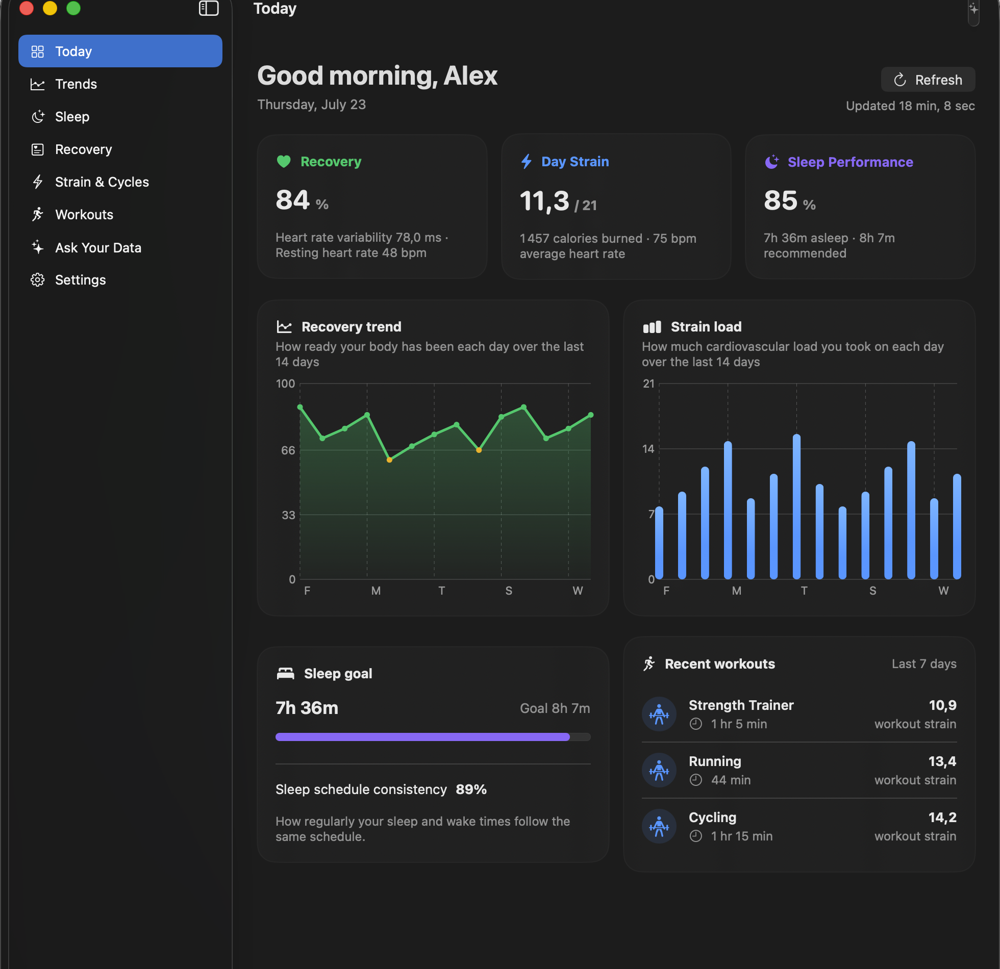
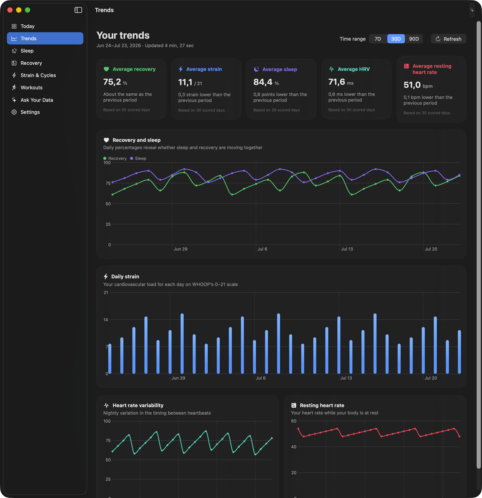
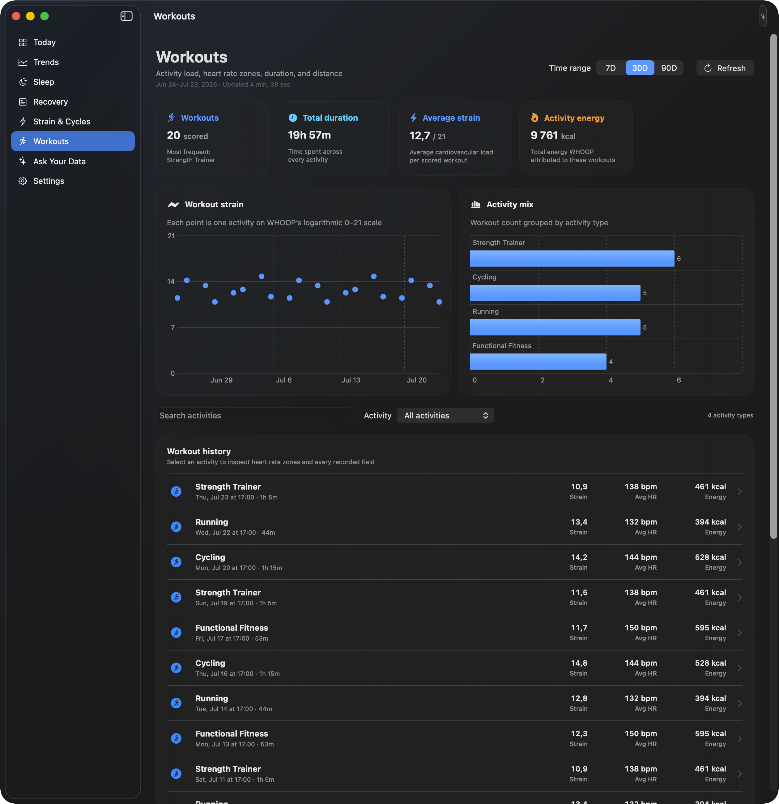
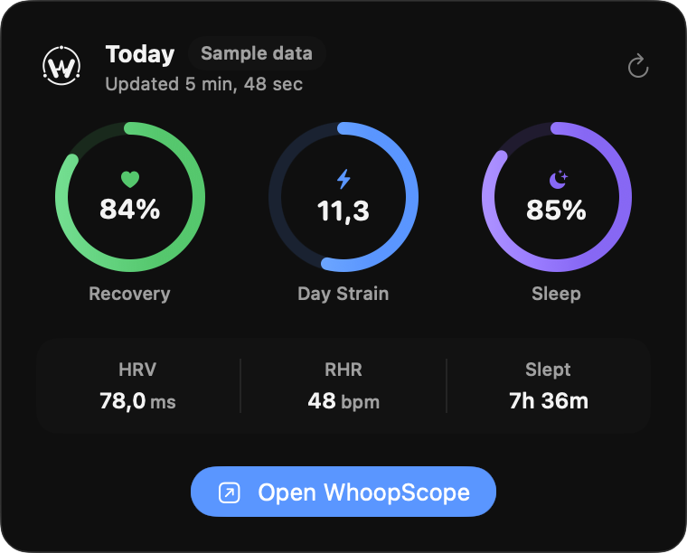

<p align="center">
  
</p>

<h1 align="center">WhoopScope</h1>

<p align="center">
  A private, native macOS home for your WHOOP history.
</p>

<p align="center">
  <a href="https://github.com/tornikegomareli/whoop-macos/releases/latest"></a>
  <a href="LICENSE"></a>
  
  <a href="https://github.com/tornikegomareli/whoop-macos/actions"></a>
</p>



WhoopScope synchronizes the data available through WHOOP's official Developer
API and turns it into a fast local dashboard, long-range trends, detailed
explorers, widgets, Siri and Spotlight actions, and grounded conversations
about your own history.

The project is free and open source. Health records stay on the Mac unless you
explicitly choose a cloud model and supply your own API key.

> [!IMPORTANT]
> WhoopScope is in early access. The shared WHOOP application is currently
> limited to the Developer Platform's pre-approval member allowance. Source
> builds and the synthetic demo are available to everyone; broader sign-in
> access depends on WHOOP application approval.

## Highlights

- Official WHOOP API coverage for profile, body measurements, cycles,
  recovery, sleep, and workouts.
- Keychain-backed OAuth tokens with automatic refresh through a minimal,
  stateless authentication broker.
- Native Today dashboard, 7/30/90-day trends, detailed record inspectors, and
  activity filtering.
- A compact menu-bar dashboard and small/medium WidgetKit desktop widgets.
- Siri, Shortcuts, and Spotlight actions for frequently requested metrics.
- Grounded data chat through Apple's on-device Foundation Models framework or
  OpenAI with your own Keychain-stored API key.
- Optional iPhone companion for complementary Apple Health activity, mobility,
  mindfulness, hydration, cardio-fitness, and body-composition summaries.
  HealthKit sleep is intentionally never requested or merged.
- Deterministic sample mode for development, screenshots, and bug reports.

## See it in action

[Watch the 13-second WhoopScope demo](docs/media/whoopscope-demo.mp4).
Every number shown in the demo and screenshots is synthetic.

| Trends | Workout explorer |
| --- | --- |
|  |  |

<p align="center">
  
</p>

## Download

Download the newest build from
[GitHub Releases](https://github.com/tornikegomareli/whoop-macos/releases/latest).

WhoopScope currently requires:

- Apple silicon Mac.
- macOS 26 or later.
- A WHOOP account for live synchronization.
- Apple Intelligence enabled for on-device chat, or an OpenAI API key for the
  optional cloud provider.

The release page states the signing and notarization status of each build.
SHA-256 checksums are attached beside downloadable builds.

## Build from source

Install Xcode 26 or later and [Mise](https://mise.jdx.dev/), then:

```bash
git clone https://github.com/tornikegomareli/whoop-macos.git
cd whoop-macos
mise trust
mise install
tuist install
tuist generate
open WhoopScope.xcworkspace
```

Select the `WhoopScope` scheme for live data. Select `WhoopScope Demo` for a
fully local synthetic archive that does not access Keychain, WHOOP, the live
widget snapshot, or the Apple Health receiver.

Run the complete macOS test suite with:

```bash
mise exec -- tuist test WhoopScope --platform macOS
```

## Connect WHOOP

The published build uses WhoopScope's authentication broker. The WHOOP Client
Secret remains on that server and is never embedded in the Mac app.

Maintainers of a fork should create their own WHOOP Developer application with:

```text
whoopscope://oauth/callback
```

Enable `offline` and all six read scopes, deploy the worker in `Broker`, and
change `WHOOPSCOPE_BROKER_URL` in `Project.swift` to the fork's HTTPS endpoint.
See [Broker/README.md](Broker/README.md) for the complete deployment and secret
rotation procedure.

## Privacy model

- WHOOP and imported Apple Health summaries are stored in the app's private
  Application Support directory.
- WHOOP tokens and model API keys are stored in Apple Keychain.
- The authentication broker exchanges and refreshes tokens but does not store
  them or receive WHOOP health records.
- Apple Health summaries travel directly from iPhone to Mac over an encrypted
  local peer-to-peer session.
- Apple Foundation Models processing stays on-device.
- When OpenAI is selected, WhoopScope shows that grounded evidence will leave
  the Mac, uses the user's own key, and sets response storage to disabled.
- The app contains no advertising, analytics, or behavioral tracking.

Read the full [privacy policy](PRIVACY.md) and
[security policy](SECURITY.md).

## Architecture

```text
Apps/Mac ───────┬── Features/{Dashboard,Trends,Explorers,Chat,Settings}
                ├── Modules/{Authentication,Data,Persistence,HealthBridge}
                └── Modules/{Domain,DesignSystem,WidgetSupport,PreviewData}

Apps/Widget ─────── Modules/WidgetSupport
Apps/iPhone ─────── Modules/{Domain,HealthBridge}
Broker ──────────── WHOOP OAuth token endpoints only
```

The domain layer owns entities and repository contracts. Infrastructure
adapters handle WHOOP networking, GRDB, Keychain, local device transfer, and
model providers. UI features depend inward on domain use cases. Tuist keeps
the project graph reproducible without committing generated Xcode projects.

## Project status

The current focus is a trustworthy first public prerelease:

- The codebase and demo are open for review and contribution.
- Public binary packaging, signing, and notarization are being verified.
- WHOOP sign-in remains capacity-limited until application approval.
- The iPhone companion is built from source for now; it is not yet distributed
  separately through TestFlight or the App Store.

WhoopScope is an educational fitness-history tool, not a medical device. It
does not diagnose conditions or provide medical advice.

## Contributing

Read [CONTRIBUTING.md](CONTRIBUTING.md) before opening a pull request. Never
attach real health records, database files, API keys, or authentication tokens
to an issue. Use the `WhoopScope Demo` scheme for reproducible reports.

Security reports must follow [SECURITY.md](SECURITY.md).
Sample workflows and grounded question ideas are in
[docs/EXAMPLES.md](docs/EXAMPLES.md).
Maintainer signing and notarization steps are in
[docs/RELEASING.md](docs/RELEASING.md).

## License and trademarks

WhoopScope is released under the
[Apache License 2.0](LICENSE). Third-party notices are in
[THIRD_PARTY_NOTICES.md](THIRD_PARTY_NOTICES.md).

WHOOP is a trademark of WHOOP, Inc. WhoopScope is an independent project and
is not affiliated with, endorsed by, or sponsored by WHOOP, Inc. Apple,
Apple Health, Siri, Spotlight, and macOS are trademarks of Apple Inc. OpenAI
is a trademark of OpenAI, L.L.C.
